<h1 align="center">
  <br/>
    DRIFT - <i>into meta commerce</i>
</h1>
<p align="center">
<image src="https://img.shields.io/badge/ThreeJs-black?style=for-the-badge&logo=three.js&logoColor=white" >
<image src="https://img.shields.io/badge/Blockchain.com-121D33?logo=blockchaindotcom&logoColor=fff&style=for-the-badge" >
</p>
<p align="center">Drift is a <b>decentralized metaverse</b> project that revolves around virtual shopping. The projects enable the users to take themselves to a virtual world that they can see and interact with using characters or avatars. The user gets a <b>3D immersive experience</b> in a highly interactive and realistic environment as well as can interact with other users around the globe.  Users on Drift can view shops in 3D and provide them an experience of visiting a real world store and provides them an opportunity to see any selected product in a three dimensional view as well as to try them on virtually  by accessing the camera of the user’s device. It also provides the user an opportunity to view the product in the real world using AR functionalities. 
The project also contains a lot of major features such as peer to peer audio, video as well as text interactions between the user both personally among users in close proximity as well as a group of users interested in a particular product or topic that they wish to discuss with other users. It also offers the users to create private rooms so that they can interact with other users actively and have interest to discuss on the particular topic.
The project also allows users to switch between First person perspective and Third person perspective as per their convenience for a better experience. 
. Multiple payment options using bank transfers, credit/ debit card and also crypto based payments
</br>
The Project also presents <b>DRIFT studio</b> a powerful self integrated editor where retailers can create and deploy shops into the metaverse
 </p>

# Tech Stack

- Three js
- Node js
- Express
- Socket IO
- Metamask
- web3js
- Firebase
- webRTC + Agora SDK
- webXR
- CLMtrackr
- razorpay

## Installing / Getting started

Please follow the instructions step by step for proper setting up of the project

- Fork the repo [here](https://github.com/KarthikS373/Drift-into-Metacommerce/fork) - <i>Please dont forget to credit me</i>

- Note: A few assets are not present in the repo due to heavy file size (please make sure to extract them from the links below and add them to the project dir)

  - Extract assets from [AR-assets.zip](https://drive.google.com/file/d/1rhzTjMORilrbkn6eaOVinzq0wwnxEcZm/view?usp=share_link) and add them to `AR` directory
  - <details>
        <summary>view structure</summary>

            DRIFT
            |
            |
            +---AR
            |   +-- assets
            |       |   stabilization.gif
            |       |
            |       \---shoe
            |           |   license.txt
            |           |   scene.bin
            |           |   scene.gltf
            |           |
            |           \---textures
            |                   Main_baseColor.png
            |                   Main_metallicRoughness.png
            |                   Main_normal.png
            |                   Material.001_baseColor.png
            |                   Material.001_metallicRoughness.png
            |                   Material.001_normal.png
    </details>

    </br>
  - Extract assets from [assets.zip](https://drive.google.com/file/d/1lCwi9IJhOYAXUTGLGFocrO7r9s85na5-/view?usp=share_link) and add them to `Client/assets` directory
  - <details>
        <summary>view structure</summary>

            DRIFT
            |
            |
            +---client
            |   
            |   +---assets
            |   |  
            |   |  
            |   |   +---models
            |   |   |   |   k-tattoo02-165765745.jpg
            |   |   |   |   shkaf_fbx.fbx
            |   |   |   |   stabilization.gif
            |   |   |   |   uploads_files_994317_SHOE+RACK-METAL.FBX
            |   |   |   |
            |   |   |   +---shoes
            |   |   |   |   |   scene.bin
            |   |   |   |   |   scene.gltf
            |   |   |   |   |
            |   |   |   |   \---textures
            |   |   |   |           material0_baseColor.jpeg
            |   |   |   |
            |   |   |   \---shop1
            |   |   |       |   license.txt
            |   |   |       |   scene.bin
            |   |   |       |   scene.gltf
            |   |   |       |
            |   |   |       \---textures
            |   |   |               6twelve_baseColor.jpeg
            |   |   |               Alcohol_baseColor.jpeg
            |   |   |               Asphalt_01_baseColor.jpeg
            |   |   |               Asphalt_baseColor.jpeg
            |   |   |               Branches_baseColor.png
            |   |   |               Bricks_baseColor.jpeg
            |   |   |               Broom_01_baseColor.png
            |   |   |               Broom_baseColor.png
            |   |   |               Candys_baseColor.png
            |   |   |               CardboardPlain_baseColor.jpeg
            |   |   |               Cigars_baseColor.png
            |   |   |               Concrete_01_baseColor.jpeg
            |   |   |               Concrete_baseColor.jpeg
            |   |   |               Control_baseColor.jpeg
            |   |   |               Door_01_baseColor.jpeg
            |   |   |               Door_02_baseColor.jpeg
            |   |   |               Door_03_baseColor.jpeg
            |   |   |               Door_baseColor.jpeg
            |   |   |               extinguisher_baseColor.jpeg
            |   |   |               Fabric_01_baseColor.jpeg
            |   |   |               Fabric_baseColor.jpeg
            |   |   |               Food_shelf_01_baseColor.jpeg
            |   |   |               Food_shelf_02_baseColor.jpeg
            |   |   |               Food_shelf_03_baseColor.jpeg
            |   |   |               Food_shelf_04_baseColor.png
            |   |   |               Food_shelf_05_baseColor.jpeg
            |   |   |               Food_shelf_baseColor.jpeg
            |   |   |               Garbage_bag_baseColor.png
            |   |   |               GrassDead_baseColor.jpeg
            |   |   |               Grass_02_baseColor.jpeg
            |   |   |               Grass_baseColor.png
            |   |   |               Hygiene_baseColor.jpeg
            |   |   |               icecream_popsicles_baseColor.png
            |   |   |               Leather_01_baseColor.jpeg
            |   |   |               Lights_01_baseColor.jpeg
            |   |   |               Lights_01_emissive.png
            |   |   |               Lights_baseColor.jpeg
            |   |   |               Lights_emissive.jpeg
            |   |   |               Lottery_baseColor.png
            |   |   |               material_baseColor.png
            |   |   |               Metal_01_baseColor.jpeg
            |   |   |               Metal_02_baseColor.jpeg
            |   |   |               Metal_03_baseColor.jpeg
            |   |   |               Metal_04_baseColor.jpeg
            |   |   |               Metal_05_baseColor.jpeg
            |   |   |               Metal_06_baseColor.jpeg
            |   |   |               Metal_07_baseColor.jpeg
            |   |   |               Metal_08_baseColor.jpeg
            |   |   |               Metal_09_baseColor.jpeg
            |   |   |               Metal_10_baseColor.jpeg
            |   |   |               Metal_baseColor.jpeg
            |   |   |               Metal_metallicRoughness.png
            |   |   |               Mostrator_baseColor.jpeg
            |   |   |               Office_baseColor.jpeg
            |   |   |               outdoor_electronics_baseColor.jpeg
            |   |   |               Parking_lot_baseColor.png
            |   |   |               Plants_01_baseColor.png
            |   |   |               Plants_02_baseColor.png
            |   |   |               Plaste_baseColor.jpeg
            |   |   |               Plastic_01_baseColor.jpeg
            |   |   |               Plastic_02_baseColor.png
            |   |   |               Plastic_03_baseColor.jpeg
            |   |   |               Plastic_04_baseColor.jpeg
            |   |   |               Plastic_05_baseColor.png
            |   |   |               Plastic_06_baseColor.jpeg
            |   |   |               Plastic_07_baseColor.png
            |   |   |               Plastic_08_baseColor.jpeg
            |   |   |               Plastic_baseColor.jpeg
            |   |   |               Prices_baseColor.jpeg
            |   |   |               Refrigerators_01_baseColor.jpeg
            |   |   |               Refrigerators_baseColor.jpeg
            |   |   |               Respirator_baseColor.png
            |   |   |               RoadMarkings_baseColor.png
            |   |   |               RoadRail_baseColor.jpeg
            |   |   |               Roof_tiles_baseColor.jpeg
            |   |   |               Scattered_baseColor.png
            |   |   |               Sign_01_baseColor.png
            |   |   |               Sign_baseColor.jpeg
            |   |   |               SoilSand_baseColor.jpeg
            |   |   |               Store_fridge_baseColor.png
            |   |   |               Tiles_baseColor.jpeg
            |   |   |               Toothbrushes_baseColor.jpeg
            |   |   |               Trash_01_baseColor.jpeg
            |   |   |               Trees_Background_baseColor.png
            |   |   |               Tree_01_baseColor.png
            |   |   |               Tree_baseColor.png
            |   |   |               Wheel_baseColor.jpeg
            |   |   |               Wood_02_baseColor.jpeg
            |   |   |               Wood_18_baseColor.jpeg
            |   |   |
            |   |   \---textures
            |   |           concrete3-albedo.png
            |   |           concrete3-metallic.png
            |   |           concrete3-normal.png
            |   |           concrete3-roughness.png
            |   |           vintage-tile1_albedo.png
            |   |           vintage-tile1_ao.png
            |   |           vintage-tile1_height.png
            |   |           vintage-tile1_metallic.png
            |   |           vintage-tile1_normal.png
            |   |           vintage-tile1_roughness.png
    </details>
    
    </br>
  - Extract assets from [src.zip](https://drive.google.com/file/d/1pRO646Ea0KK9fqWilY9f4O448WnlOgrr/view?usp=share_link) and add them to `Client/src` directory
  - <details>
        <summary>view structure</summary>

            DRIFT
            |
            |
            +---src
            |       
            |
            |       +---buildings
            |       |   |   coordinates.js
            |       |   |
            |       |   \---city
            |       |       |   license.txt
            |       |       |   scene.bin
            |       |       |   scene.gltf
            |       |       |
            |       |       \---textures
            |       |               Basketball_baseColor.png
            |       |               CityProps_baseColor.png
            |       |               Clinic_baseColor.png
            |       |               elise_baseColor.png
            |       |               FillerBuildings1_baseColor.png
            |       |               FishFactory_baseColor.png
            |       |               Laundrymat_baseColor.png
            |       |               LMProjects1GLOW_baseColor.png
            |       |               Paramount_baseColor.png
            |       |               Pawnshop_baseColor.png
            |       |               RoadsGround_baseColor.png
            |       |               Tire_baseColor.png
            |       |
            |       +---character
            |       |   |   ami.fbx
            |       |   |   Ami.js
            |       |   |   FileList.js
            |       |   |   helen.fbx
            |       |   |   Helen.js
            |       |   |   henry-.fbx
            |       |   |   henry.fbx
            |       |   |   Henry.js
            |       |   |   npc.fbx
            |       |   |   Npc.js
            |       |   |   remy.fbx
            |       |   |   Remy.js
            |       |   |
            |       |   +---animations
            |       |   |       clap.fbx
            |       |   |       idle.fbx
            |       |   |       jump.fbx
            |       |   |       left strafe walk.fbx
            |       |   |       left strafe.fbx
            |       |   |       left turn.fbx
            |       |   |       right strafe walk.fbx
            |       |   |       right strafe.fbx
            |       |   |       right turn.fbx
            |       |   |       running.fbx
            |       |   |       untitled.fbx
            |       |   |       walking.fbx
            |       |   |       wave.fbx
            |       |   |
            |       |   +---character-controller
            |       |   |       AnimationController.js
            |       |   |       AnimatorModeAdapter.js
            |       |   |       CameraController.js
            |       |   |       CharacterController.js
            |       |   |       DisplacementController.js
            |       |   |       InputController.js
            |       |   |       RotationController.js
            |       |   |       ShadowController.js
            |       |   |
            |       |   \---character-selector
            |       |           CharacterSelector.js
            |       |           Landing.js
            |       |           Player.js
    </details>

    </br>


- Once you are done with this steps, open terminal and type the following commands
```shell
    $ cd server
    $ npm install
    $ npm start
```

- Project will be live and running on [localhost:5000](http://localhost:5000)

> 💡 Please verify the final project setup with the project structure below for smooth and error free functioning

<details>
  <summary><b>Project Structure</b></summary>

```bash
DRIFT
|
|
+---AR
|   +---ar-drift
|   |       app.css
|   |       app.js
|   |       index.html
|   |       utils.js
|   |
|   \---assets
|       |   stabilization.gif
|       |
|       \---shoe
|           |   license.txt
|           |   scene.bin
|           |   scene.gltf
|           |
|           \---textures
|                   Main_baseColor.png
|                   Main_metallicRoughness.png
|                   Main_normal.png
|                   Material.001_baseColor.png
|                   Material.001_metallicRoughness.png
|                   Material.001_normal.png
|
+---client
|   |   avatar.html
|   |   cart.html
|   |   checkout.html
|   |   editor.html
|   |   index.html
|   |   lobby.html
|   |   login.html
|   |   meta.html
|   |   payment-plans.html
|   |   product.html
|   |   room.html
|   |   shop.html
|   |   tryon.html
|   |   view-cart.html
|   |
|   +---assets
|   |   +---db
|   |   |       db.js
|   |   |
|   |   +---env
|   |   |       negx.jpg
|   |   |       negy.jpg
|   |   |       negz.jpg
|   |   |       posx.jpg
|   |   |       posy.jpg
|   |   |       posz.jpg
|   |   |
|   |   +---glasses
|   |   |       glass1.png
|   |   |       glass2.png
|   |   |       left.png
|   |   |       right.png
|   |   |
|   |   +---Icons
|   |   |       menu.svg
|   |   |       microphone.png
|   |   |       mute.png
|   |   |       shopping cart.png
|   |   |       video.png
|   |   |
|   |   +---Images
|   |   |       Ami.png
|   |   |       Helen.png
|   |   |       Henry.png
|   |   |       Logo.png
|   |   |       Logo_dark.png
|   |   |       Logo_light.png
|   |   |       pic1.png
|   |   |       rayban.png
|   |   |       Remy.png
|   |   |
|   |   +---models
|   |   |   |   k-tattoo02-165765745.jpg
|   |   |   |   shkaf_fbx.fbx
|   |   |   |   stabilization.gif
|   |   |   |   uploads_files_994317_SHOE+RACK-METAL.FBX
|   |   |   |
|   |   |   +---shoes
|   |   |   |   |   scene.bin
|   |   |   |   |   scene.gltf
|   |   |   |   |
|   |   |   |   \---textures
|   |   |   |           material0_baseColor.jpeg
|   |   |   |
|   |   |   \---shop1
|   |   |       |   license.txt
|   |   |       |   scene.bin
|   |   |       |   scene.gltf
|   |   |       |
|   |   |       \---textures
|   |   |               6twelve_baseColor.jpeg
|   |   |               Alcohol_baseColor.jpeg
|   |   |               Asphalt_01_baseColor.jpeg
|   |   |               Asphalt_baseColor.jpeg
|   |   |               Branches_baseColor.png
|   |   |               Bricks_baseColor.jpeg
|   |   |               Broom_01_baseColor.png
|   |   |               Broom_baseColor.png
|   |   |               Candys_baseColor.png
|   |   |               CardboardPlain_baseColor.jpeg
|   |   |               Cigars_baseColor.png
|   |   |               Concrete_01_baseColor.jpeg
|   |   |               Concrete_baseColor.jpeg
|   |   |               Control_baseColor.jpeg
|   |   |               Door_01_baseColor.jpeg
|   |   |               Door_02_baseColor.jpeg
|   |   |               Door_03_baseColor.jpeg
|   |   |               Door_baseColor.jpeg
|   |   |               extinguisher_baseColor.jpeg
|   |   |               Fabric_01_baseColor.jpeg
|   |   |               Fabric_baseColor.jpeg
|   |   |               Food_shelf_01_baseColor.jpeg
|   |   |               Food_shelf_02_baseColor.jpeg
|   |   |               Food_shelf_03_baseColor.jpeg
|   |   |               Food_shelf_04_baseColor.png
|   |   |               Food_shelf_05_baseColor.jpeg
|   |   |               Food_shelf_baseColor.jpeg
|   |   |               Garbage_bag_baseColor.png
|   |   |               GrassDead_baseColor.jpeg
|   |   |               Grass_02_baseColor.jpeg
|   |   |               Grass_baseColor.png
|   |   |               Hygiene_baseColor.jpeg
|   |   |               icecream_popsicles_baseColor.png
|   |   |               Leather_01_baseColor.jpeg
|   |   |               Lights_01_baseColor.jpeg
|   |   |               Lights_01_emissive.png
|   |   |               Lights_baseColor.jpeg
|   |   |               Lights_emissive.jpeg
|   |   |               Lottery_baseColor.png
|   |   |               material_baseColor.png
|   |   |               Metal_01_baseColor.jpeg
|   |   |               Metal_02_baseColor.jpeg
|   |   |               Metal_03_baseColor.jpeg
|   |   |               Metal_04_baseColor.jpeg
|   |   |               Metal_05_baseColor.jpeg
|   |   |               Metal_06_baseColor.jpeg
|   |   |               Metal_07_baseColor.jpeg
|   |   |               Metal_08_baseColor.jpeg
|   |   |               Metal_09_baseColor.jpeg
|   |   |               Metal_10_baseColor.jpeg
|   |   |               Metal_baseColor.jpeg
|   |   |               Metal_metallicRoughness.png
|   |   |               Mostrator_baseColor.jpeg
|   |   |               Office_baseColor.jpeg
|   |   |               outdoor_electronics_baseColor.jpeg
|   |   |               Parking_lot_baseColor.png
|   |   |               Plants_01_baseColor.png
|   |   |               Plants_02_baseColor.png
|   |   |               Plaste_baseColor.jpeg
|   |   |               Plastic_01_baseColor.jpeg
|   |   |               Plastic_02_baseColor.png
|   |   |               Plastic_03_baseColor.jpeg
|   |   |               Plastic_04_baseColor.jpeg
|   |   |               Plastic_05_baseColor.png
|   |   |               Plastic_06_baseColor.jpeg
|   |   |               Plastic_07_baseColor.png
|   |   |               Plastic_08_baseColor.jpeg
|   |   |               Plastic_baseColor.jpeg
|   |   |               Prices_baseColor.jpeg
|   |   |               Refrigerators_01_baseColor.jpeg
|   |   |               Refrigerators_baseColor.jpeg
|   |   |               Respirator_baseColor.png
|   |   |               RoadMarkings_baseColor.png
|   |   |               RoadRail_baseColor.jpeg
|   |   |               Roof_tiles_baseColor.jpeg
|   |   |               Scattered_baseColor.png
|   |   |               Sign_01_baseColor.png
|   |   |               Sign_baseColor.jpeg
|   |   |               SoilSand_baseColor.jpeg
|   |   |               Store_fridge_baseColor.png
|   |   |               Tiles_baseColor.jpeg
|   |   |               Toothbrushes_baseColor.jpeg
|   |   |               Trash_01_baseColor.jpeg
|   |   |               Trees_Background_baseColor.png
|   |   |               Tree_01_baseColor.png
|   |   |               Tree_baseColor.png
|   |   |               Wheel_baseColor.jpeg
|   |   |               Wood_02_baseColor.jpeg
|   |   |               Wood_18_baseColor.jpeg
|   |   |
|   |   \---textures
|   |           concrete3-albedo.png
|   |           concrete3-metallic.png
|   |           concrete3-normal.png
|   |           concrete3-roughness.png
|   |           vintage-tile1_albedo.png
|   |           vintage-tile1_ao.png
|   |           vintage-tile1_height.png
|   |           vintage-tile1_metallic.png
|   |           vintage-tile1_normal.png
|   |           vintage-tile1_roughness.png
|   |
|   +---css
|   |       cart.css
|   |       editor.css
|   |       hexagon.css
|   |       home.css
|   |       loader.css
|   |       lobby.css
|   |       main.css
|   |       payment-plans.css
|   |       room.css
|   |       shop.css
|   |       style.css
|   |       toastify.css
|   |       tryon.css
|   |       view-cart.css
|   |
|   +---images
|   |       building.jpg
|   |       city.png
|   |       ground.jpg
|   |       ground1.jpg
|   |       sky.jpg
|   |       wooden.jpg
|   |
|   +---js
|   |       clmtrackr.js
|   |       controllers.js
|   |       FBXLoader.js
|   |       flatte.min.js
|   |       FunctionalComponent.js
|   |       GLTFExporter.js
|   |       GLTFLoader.js
|   |       gsap.min.js
|   |       jquery.min.js
|   |       LoaderUtils.js
|   |       OBJLoader.js
|   |       OrbitControls.js
|   |       RayCaster.js
|   |       three.js
|   |       three.min.js
|   |       threeUtils.js
|   |
|   \---src
|       |   Bootstrap.js
|       |   index.js
|       |
|       +---buildings
|       |   |   coordinates.js
|       |   |
|       |   \---city
|       |       |   license.txt
|       |       |   scene.bin
|       |       |   scene.gltf
|       |       |
|       |       \---textures
|       |               Basketball_baseColor.png
|       |               CityProps_baseColor.png
|       |               Clinic_baseColor.png
|       |               elise_baseColor.png
|       |               FillerBuildings1_baseColor.png
|       |               FishFactory_baseColor.png
|       |               Laundrymat_baseColor.png
|       |               LMProjects1GLOW_baseColor.png
|       |               Paramount_baseColor.png
|       |               Pawnshop_baseColor.png
|       |               RoadsGround_baseColor.png
|       |               Tire_baseColor.png
|       |
|       +---character
|       |   |   ami.fbx
|       |   |   Ami.js
|       |   |   FileList.js
|       |   |   helen.fbx
|       |   |   Helen.js
|       |   |   henry-.fbx
|       |   |   henry.fbx
|       |   |   Henry.js
|       |   |   npc.fbx
|       |   |   Npc.js
|       |   |   remy.fbx
|       |   |   Remy.js
|       |   |
|       |   +---animations
|       |   |       clap.fbx
|       |   |       idle.fbx
|       |   |       jump.fbx
|       |   |       left strafe walk.fbx
|       |   |       left strafe.fbx
|       |   |       left turn.fbx
|       |   |       right strafe walk.fbx
|       |   |       right strafe.fbx
|       |   |       right turn.fbx
|       |   |       running.fbx
|       |   |       untitled.fbx
|       |   |       walking.fbx
|       |   |       wave.fbx
|       |   |
|       |   +---character-controller
|       |   |       AnimationController.js
|       |   |       AnimatorModeAdapter.js
|       |   |       CameraController.js
|       |   |       CharacterController.js
|       |   |       DisplacementController.js
|       |   |       InputController.js
|       |   |       RotationController.js
|       |   |       ShadowController.js
|       |   |
|       |   \---character-selector
|       |           CharacterSelector.js
|       |           Landing.js
|       |           Player.js
|       |
|       +---collision
|       |       buildingBox.js
|       |       characterBox.js
|       |
|       +---editor
|       |       editor.js
|       |       main.js
|       |       payment-plan.js
|       |
|       +---env
|       |   |   Animator.js
|       |   |   Area.js
|       |   |   Camera.js
|       |   |   CleanUp.js
|       |   |   EventEmitter.js
|       |   |   KeyListener.js
|       |   |   Light.js
|       |   |   Loader.js
|       |   |   LoopMachine.js
|       |   |   Renderer.js
|       |   |   Resize.js
|       |   |   Scene.js
|       |   |   Texture.js
|       |   |
|       |   \---shapes
|       |           Cylinder.js
|       |           Plane.js
|       |           Sky.js
|       |
|       +---payment
|       |       crypto.js
|       |       razorpay.js
|       |
|       +---screens
|       |       BuildingInner.js
|       |
|       +---shop
|       |       loadShop.js
|       |       shop.js
|       |
|       +---tryon
|       |       cart.js
|       |       products.js
|       |       tryon.js
|       |       utils.js
|       |       view-cart.js
|       |
|       +---UI
|       |       characterSelector.html
|       |       HomeScreen.js
|       |       login.js
|       |
|       +---Utils
|       |       feature.js
|       |       LazyLoad.js
|       |       loadScript.js
|       |       sockets.js
|       |       toastify.js
|       |       uuid.js
|       |
|       \---video
|               agora-rtm-sdk-1.4.5.js
|               AgoraRTC_N-4.12.2.js
|               lobby.js
|               room.js
|               room_rtc.js
|               room_rtm.js
|
\---server
        package-lock.json
        package.json
        server.js


```

</details>

</br>
</br>

## DRIFT at a glance

| | | |
|:-------------------------:|:-------------------------:|:-------------------------:|
|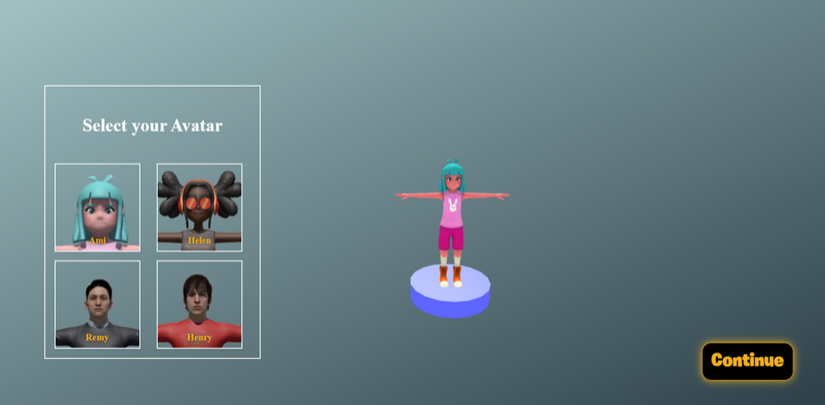 |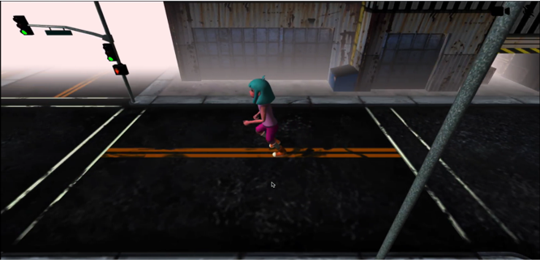 |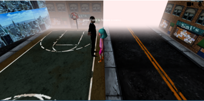 |
|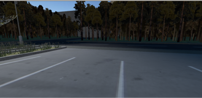 |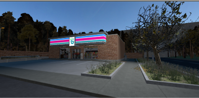 |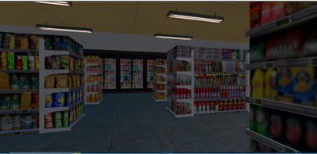 |
|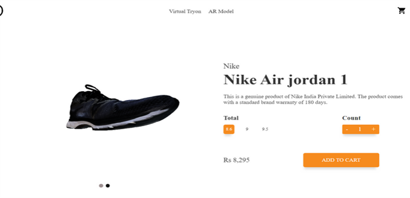 |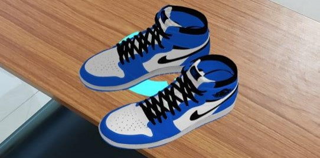 |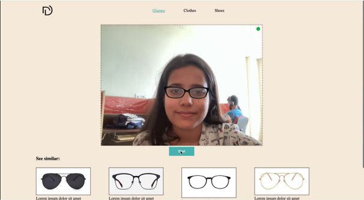 |
| |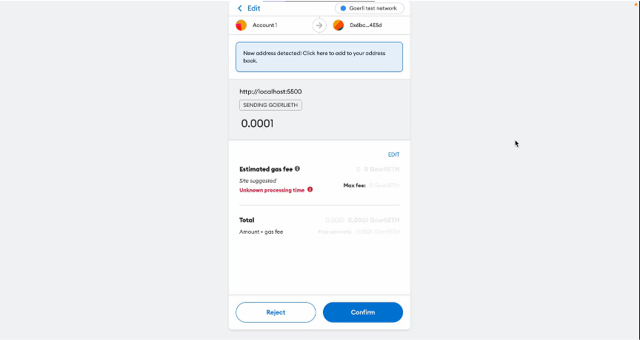 |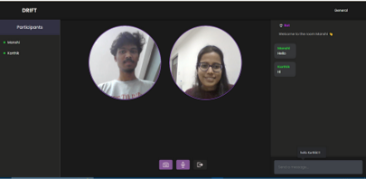 
|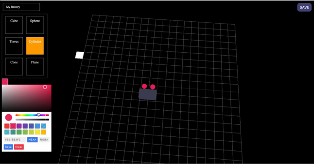 


